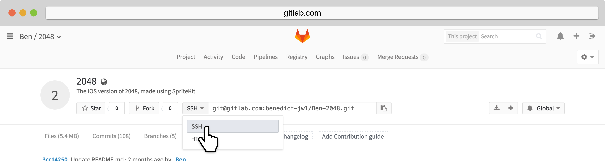
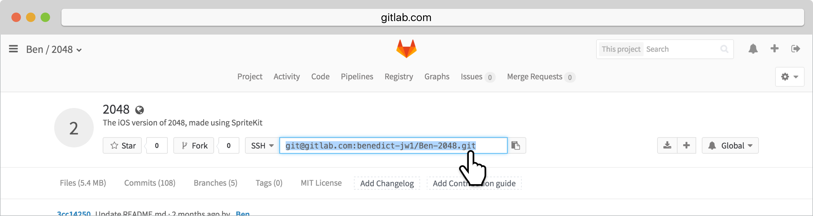
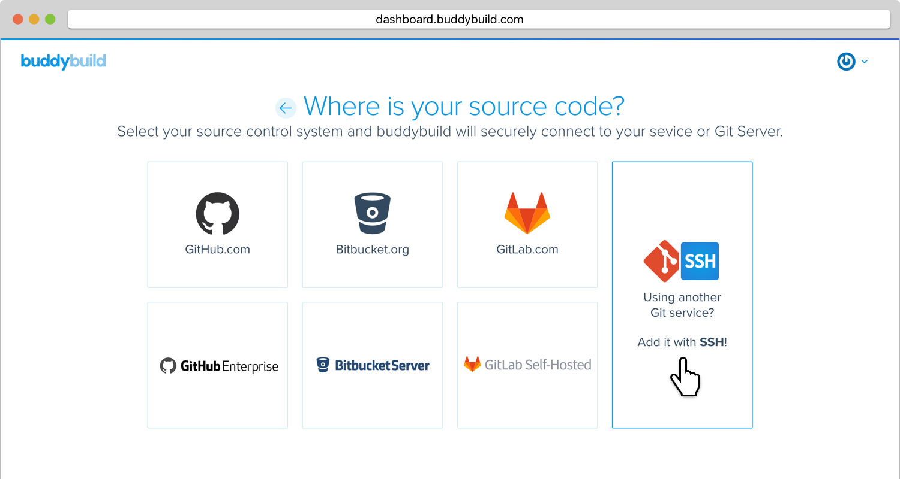
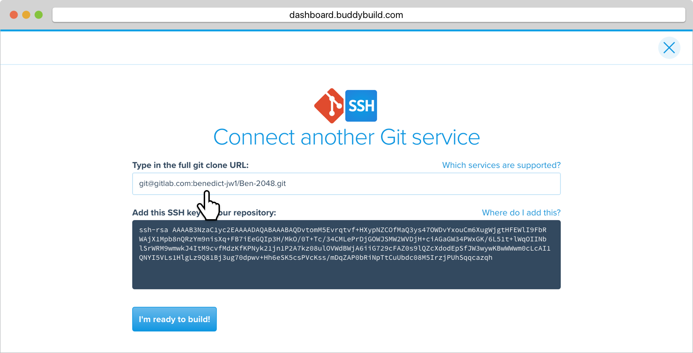
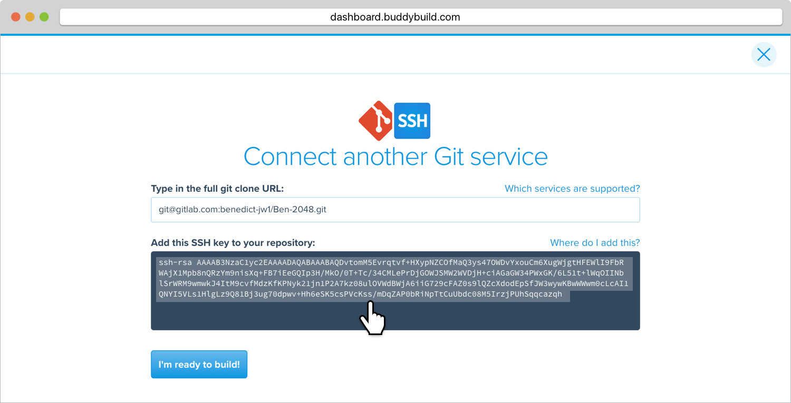
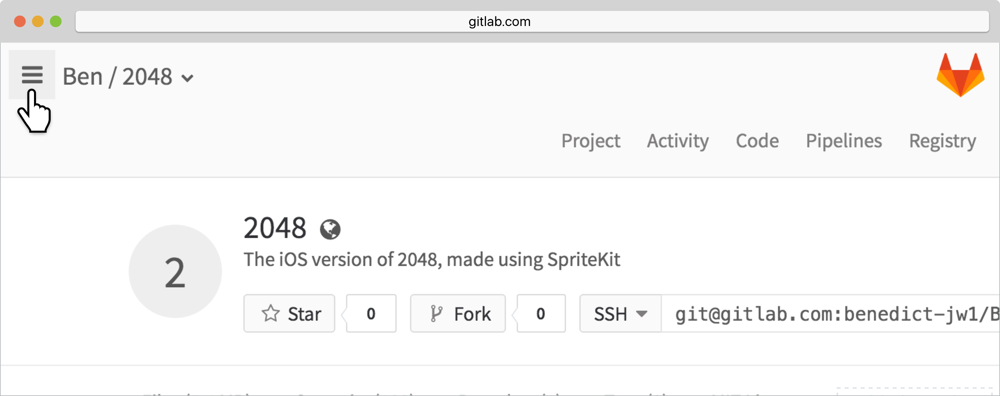
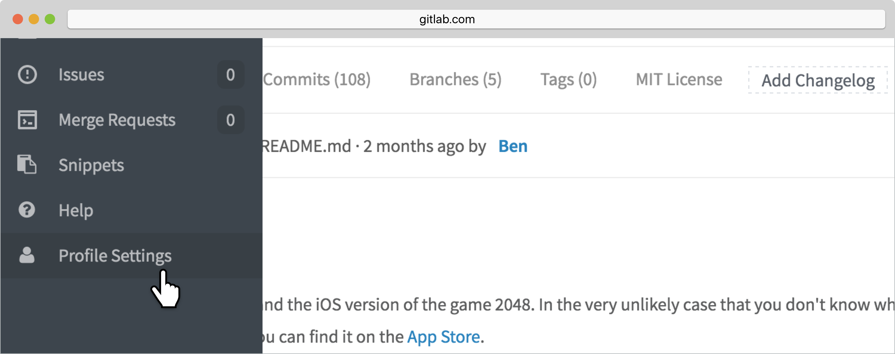
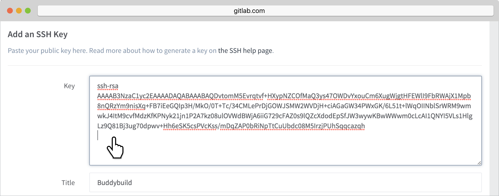
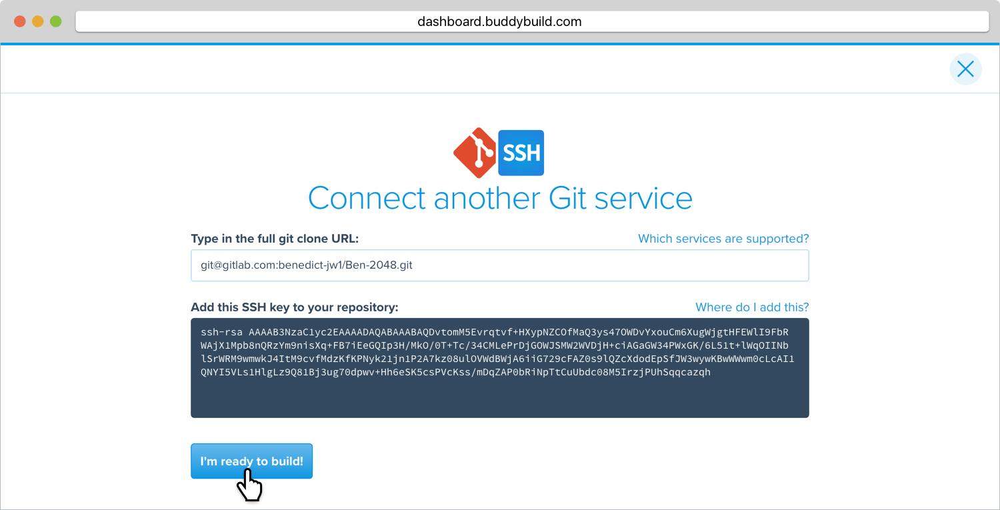

= Adding a GitLab Repository

If your repository lives in GitLab, you can
link:../../quickstart/gitlab_private.adoc[connect your repository
automatically], or connect via SSH if you prefer.

If you prefer SSH, buddybuild will automatically generate a secure SSH
key for you to install into your source control system. Buddybuild will
use this key to clone your repository.

Let's get started!

[NOTE]
======
**Quick Links**

- link:#step1[Step 1: Enter the SSH Git Clone URL]

- link:#step2[Step 2: Add the SSH Key to Your GitLab Account]
======

[[step1]]
== Step 1: Enter the SSH Git Clone URL

Within the main page of your repository, look to the middle of the page
for the **HTTPS/SSH dropdown**. Click it and select **SSH** (if it is
not already selected).

Highlight and copy the **SSH URL**.

Head over to dashboard, visit
link:https://dashboard.buddybuild.com/apps/wizard/build/select-source[Select
source] and choose **SSH**.

Paste the SSH URL you copied into the **Git clone URL** field.

[[step2]]
== Step 2: Add the SSH Key to Your GitLab Account

Highlight and copy the generated SSH key.

Navigate to your Profile Settings by first selecting the **menu icon**
in the top left corner.

In the menu that slides out, select **Profile Settings**.

Next, select **SSH Keys**.

image:img/click-ssh-keys.png[,3000,590]

Add a new SSH Key by pasting the copied SSH key into the **Key** field,
and entering **Buddybuild** as the title.

Next, click **Add Key.**

[WARNING]
=========
**Private git submodules and private cocoapods**

If your project depends on any code in other private git repos, the ssh
key will need to be added to those repos as well.
=========

Navigate back to buddybuild and click on the **Build** button.

Buddybuild will checkout your project code and kick off a simulator
build. The build should finish within a few seconds.

That's it. You're now connected to buddybuild. The next step is to
link:../../quickstart/ios/invite_testers.adoc[invite testers] to try out
your App.
