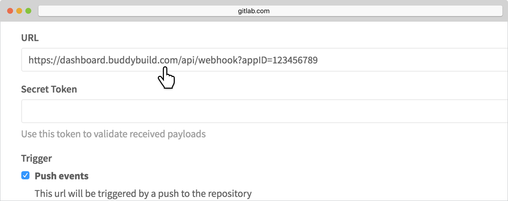
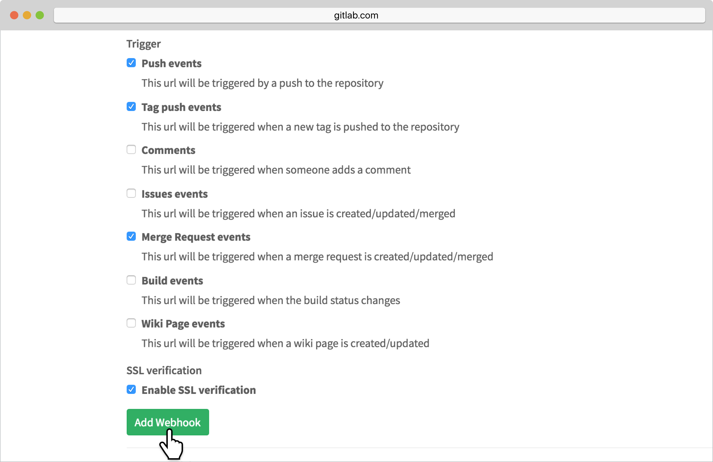

= Adding a GitLab Webhook

A webhook notifies buddybuild of code changes that you make to your repo.
Whenever a new change is pushed, buddybuild automatically kicks off
a new build -- ensuring that you have up-to-date build status and your
testers have the very latest builds.

Let's get started!

On the Builds page, in the red banner at the top of the page, click on
**Resolve this issue**.

image:../img/resolve-banner.png["The auto-build resolution banner in the
buddybuild dashboard", 1500, 298]

In the dialog box that appears, **select and copy the webhook URL**.
This URL is specific to your app and is used to identify your app when
sending webhooks from GitLab.

image:../img/modal.png["The webhook URL dialog", 1500, 838]

Navigate to your GitLab repository. In the top right corner, select the
**Settings dropdown**.

image:img/click-settings-dropdown.png["The GitLab project settings
dropdown", 3000, 1188]

Select **Webhooks** in the menu that appears.

image:img/click-webhooks.png["The GitLab project settings dropdown, with
webhooks selected", 3000, 1188]

Paste the URL you first copied into the **URL** field.

Select **Push events, Tag push events and Merge Request events**. Ensure
that **Enable SSL verification** is selected and click **Add Webhook**.
You're now done!

