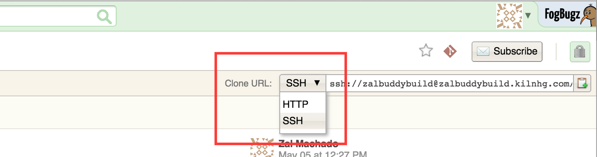
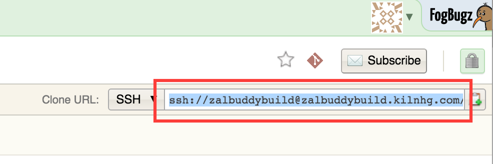
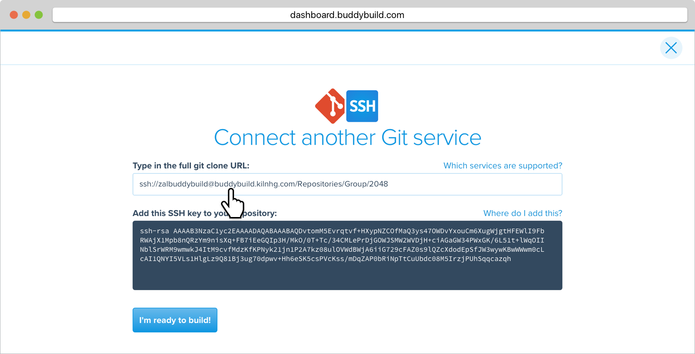
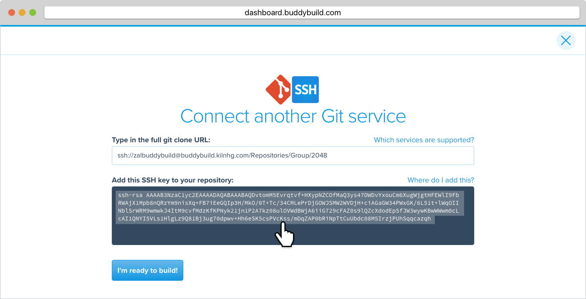
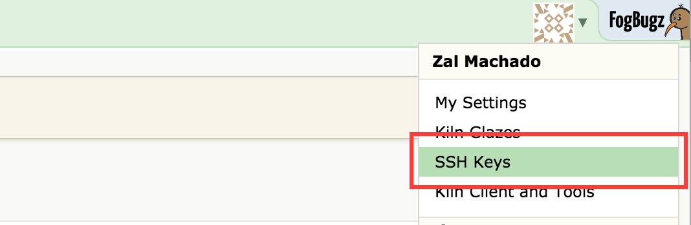
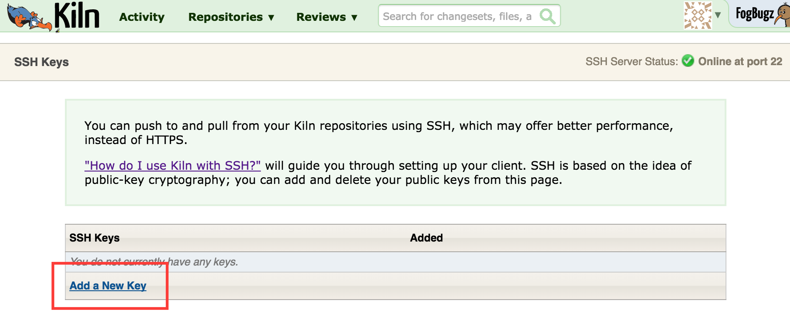
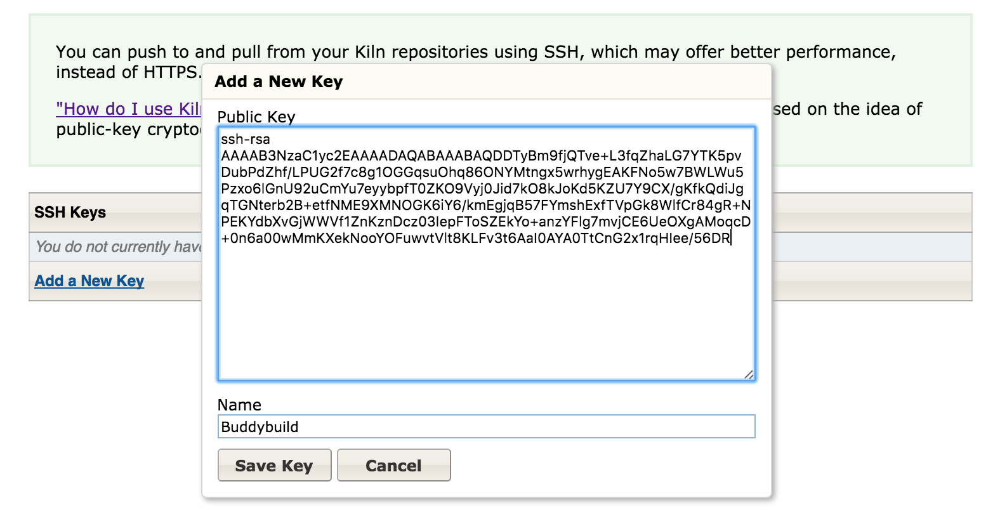
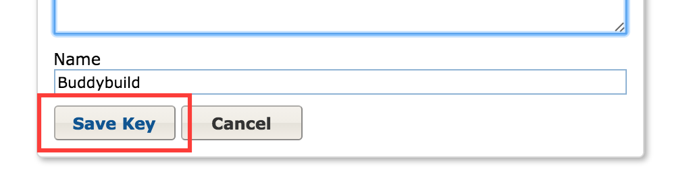
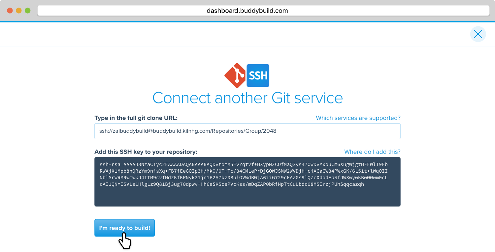

= Adding a Kiln Repository

If your repository lives in Kiln, you can connect to it via SSH.
Buddybuild will automatically generate a secure SSH key for you to
install into your source control system. Buddybuild will use this key to
clone your repository.

Let's get started!

[NOTE]
======
**Quick Links**

- link:#step1[Step 1: Enter the SSH Git Clone URL]

- link:#step2[Step 2: Add the SSH Key to Your Kiln Account]
======

[[step1]]
== Step 1: Enter the SSH Git Clone URL

Go to Kiln and find the repository you would like to connect with
buddybuild. Within the main page of that repository, look to the
top-right for the **Clone URL**. Click on the dropdown menu and select
**SSH**.

Highlight and copy the **SSH** clone URL.

Head over to dashboard, visit
link:https://dashboard.buddybuild.com/apps/wizard/build/select-source[Select
source] and choose **SSH**.

image:../img/select_source-ssh.png[,1500,800]

Paste the SSH URL you copied into the **Git clone URL** field.

[[step2]]
== Step 2: Add the SSH Key to Your Kiln Account

Highlight and copy the generated SSH key.

Navigate to your Kiln Account by first selecting your account photo, and
then select **SSH Keys**.

Next, select **Add a New Key.** 

Paste the copied SSH key into the **Public Key** field and enter
**Buddybuild** as the name.

Next, click **Save Key**.

[WARNING]
=========
**Private git submodules and private cocoapods**

If your project depends on any code in other private git repositories,
the SSH key needs to be added to those repositories as well.
=========

Navigate back to buddybuild and click on the **Build** button.

Buddybuild will checkout your project code and kick off a simulator
build. The build should finish within a few seconds.

That's it. You're now connected to buddybuild. The next step is to
link:../../quickstart/ios/invite_testers.adoc[invite testers] to try out
your App.
