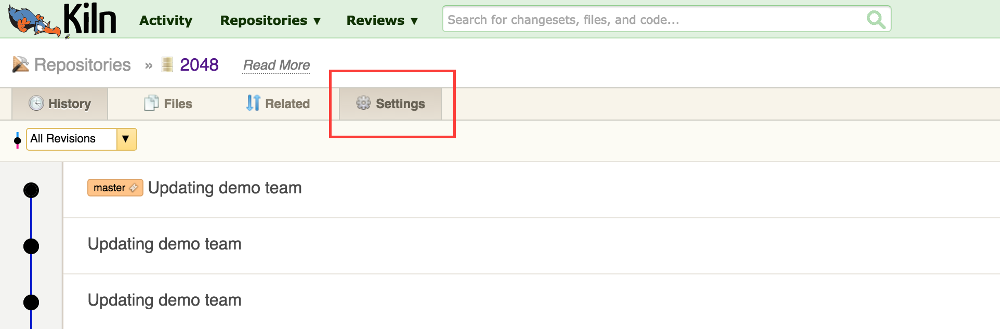
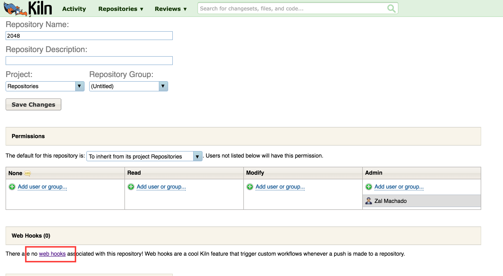
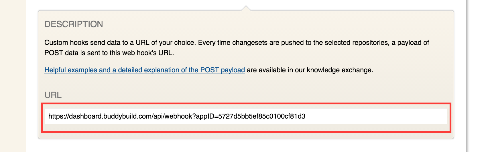

= Adding a Kiln Webhook

A webhook notifies buddybuild of code changes that you make to your
repository. Whenever a new change is pushed, buddybuild automatically
builds your app -- ensuring that you have up-to-date build status and
your testers have the very latest changes.

Let's get started!

On the **Builds** page you will notice a big red banner labeled
*Looking for builds to be kicked off automatically?* To get started
click the **Resolve this issue** button.

image:../img/resolve-banner.png["The auto-build resolution banner in the
buddybuild dashboard", 1500, 298]

In the dialog box that appears, **select and copy the webhook URL**.
This URL is specific to your app and is used to identify your app when
sending webhooks from Kiln.

image:../img/modal.png["The webhook URL dialog", 1500, 838]

Navigate to your Kiln repository. On the top navigation bar, select
**Settings.**

Click the **web hooks** link under the section **Web Hooks**.

Click the **Create a new web hook...** button.

image:img/click-create-web-hook.png["The Kiln web hooks screen", 2014,
574]

Enter a name for the web hook, and then set the web hook **Type** to
**Custom**.

image:img/set-web-hook-name.png["The Kiln web hook creation screen",
2565, 1131]

Paste the URL you first copied into the **URL** field.

In the **Repositories** field, start typing the name of your repository,
then select it. Remember that the buddybuild webhook URL is specific to
your app, so you must create a new web hook in Kiln for each app, even
if your repository contains multiple apps.

image:img/set-repositories.png["The Kiln web hook repository trigger
field", 1627, 320]

Finally, click the **Create web hook** button. You're now done!

image:img/create-web-hook.png["The Kiln Create web hook button", 1633,
453]
