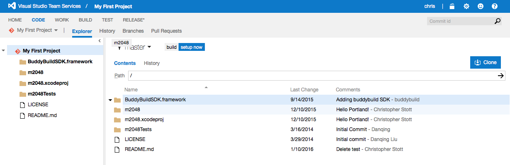

= Add a Visual Studio Online Repository

If your repository lives in Visual Studio Online / Team Foundation
Server (TFS), you can connect to it via SSH.

Buddybuild currently requires you to create a personal access token in
Visual Studio online, then provide us with a Git URL for your repository
that includes this personal access token.

It should take about 5 minutes to get signed up. Let's get started!

== Generating a personal access token

Head over to dashboard, visit
link:https://dashboard.buddybuild.com/apps/wizard/build/select-source[Select
source] and choose **SSH**.

image:../img/select_source-ssh.png["The buddybuild Select source
screen", 1500, 800]

Once you see this screen in buddybuild, head over to Visual Studio
online. The URL looks like: https://myteam.visualstudio.com.

image:img/connect.png["The buddybuild Connect another Git service
screen", 1500, 765]

Go into your personal profile (hover over your username in the top
right, and select **My Profile**), select the **Security** Tab, and then
add a **Personal Access Token.**

image:img/personal-access-token.png["The Visual Studio Online, Create a
personal access token screen", 1232, 717]

Make a note of the **personal access token** that is generated.

== Find your repo URL

Go to your project page and click the **Clone** button on the top right.

You will get an HTTPS URL like this:

[source,text]
----
https://buddybuild.visualstudio.com/DefaultCollection/_git/My%20First%20Project
----

== Combine the repo URL and personal access token

The final step in preparing your URL is to add the personal access token
into the repo URL. Paste it into the repo URL, so it looks like this,
replacing `MY_ACCESS_TOKEN` with your personal access token and adding
an `@`.

[source,text]
----
https://MY_ACCESS_TOKEN@buddybuild.visualstudio.com/DefaultCollection/_git/My%20First%20Project
----

== Finish sign up

Back on buddybuild, paste the HTTPS URL into the git clone URL text box.

You can ignore the formatting suggestions, and also ignore the SSH key
we offer. They don't apply to Visual Studio online hosted git repos.

Click on the **Build** button.

image:img/build.png["The buddybuild Connect another Git service screen,
clicking the I'm ready to build! button", 1500, 765]

Buddybuild clones your project code and starts a simulator build. The
build should finish within a few minutes.

That's it! Your Visual Studio Online repository is now connected to
buddybuild, and your first build is under way. The next steps are:

- link:webhook.adoc[Add a Visual Studio Online webhook] to automatically
  notify buddybuild of repository changes.

- link:../../quickstart/ios/invite_testers.adoc[invite testers] to try out
  your app.
