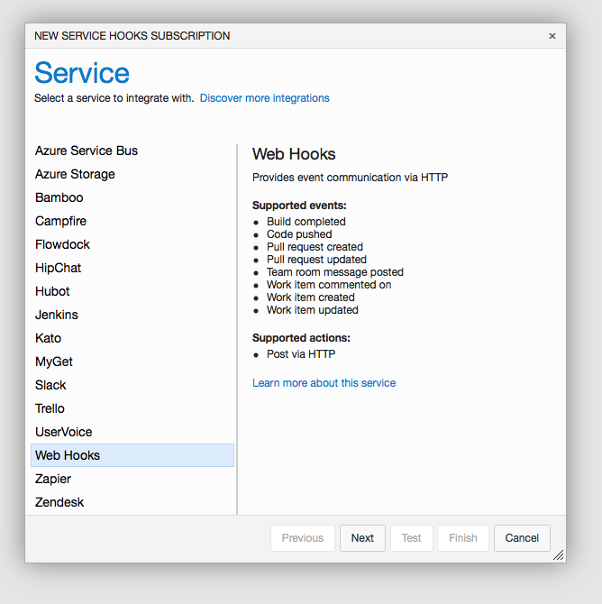
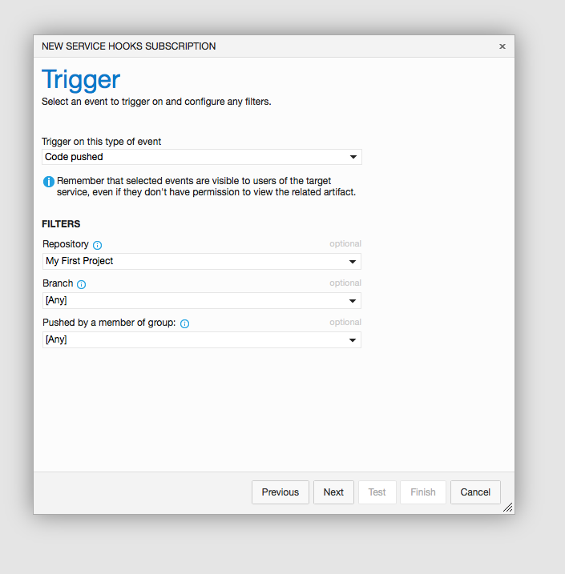
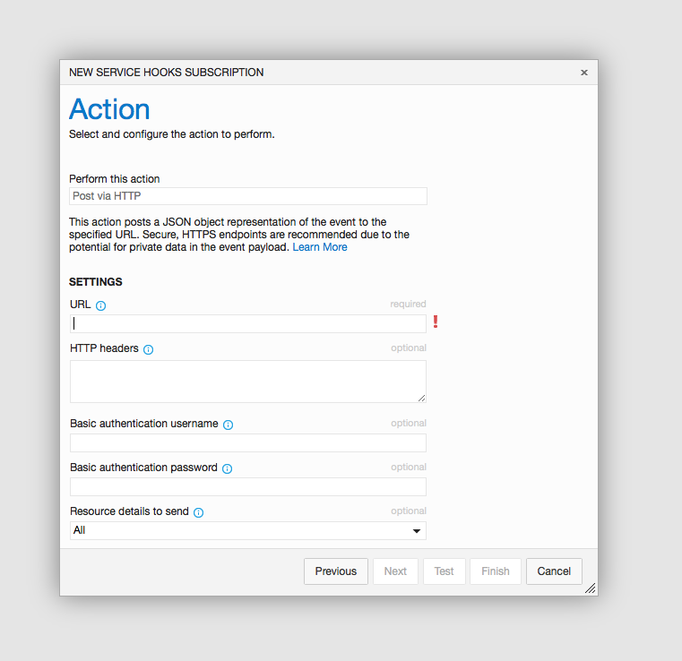

= Adding a Visual Studio Online Webhook

We're not currently able to automatically add a webhook with Visual
Studio Online.

Here are the instructions to do it manually. It should only take a
couple of minutes.

First, go to the project settings, and the 'Service Hooks' tab. You can
create a subscription.

Choose the **Web Hooks** option.

Then choose your triggers. Select **Code pushed** and **Any** branch and
**Any** member.

Then paste in the **buddybuild webhook URL** that was provided in
buddybuild's dashboard.

That's it! Next time you git push to your repo, buddybuild will trigger
a build.
