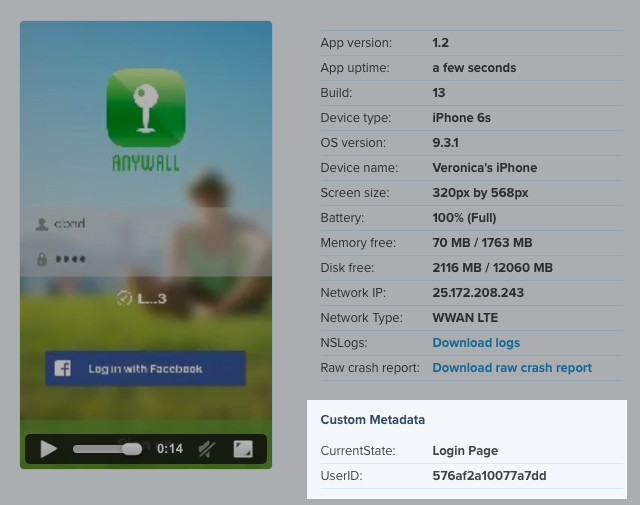

= SDK API

Buddybuild provides a set of APIs to consuming apps.

== Setup

In order to consume the SDK APIs, you must first call the setup method
from within your App Delegate.

[[code-samples]]
--
[source,objectivec]
----
[BuddyBuildSDK setup];
----

[source,swift]
----
BuddyBuildSDK.setup()
----
--

== Specifying User Information

If you distribute a build to someone with their email address,
buddybuild can figure out who they are and attach their info to feedback
and crash reports.

However, if you send out a build to a mailing list, or through
TestFlight or the App Store we are unable to infer who they are. If you
see 'Unknown User' this is likely the cause.

Often you'll know the identity of your user, for example, after they've
logged in. You can provide buddybuild a callback to identify the current
user.

[WARNING]
=========
**Make sure to identify the user before setup**

call `[BuddyBuildSDK setUserDisplayNameCallback:]` before
`[BuddyBuildSDK setup]` for it to function correctly with crash
reporting.
=========

[[code-samples]]
--
[source,objectivec]
----
// Make sure it gets called before [BuddyBuildSDK setup]
[BuddyBuildSDK setUserDisplayNameCallback:^() {
  return @"Johnny Appleseed";
}];

// Later on call setup
[BuddyBuildSDK setup];
----

[source,swift]
----
// Make sure it gets called before BuddyBuildSDK.setup()
BuddyBuildSDK.setUserDisplayNameCallback { () -> String! in
  return "Johnny App Builder"
}

// Later on call setup
BuddyBuildSDK.setup()
----
--

If you return an empty string, buddybuild will fall back to the original
behavior.

== Access API keys and other variables

You might have API keys and other secrets that your app needs to
consume. However, you may not want to check these secrets into the
source code.

You can provide your secrets to buddybuild. Buddybuild can then expose
them to you at build time through environment variables. These secrets
can also be configured to be included into built app. We obfuscate the
device keys to prevent unauthorized access.

You can consume these embedded keys using the API below:

[[code-samples]]
--
[source,objectivec]
----
NSString* accessToken = [BuddyBuildSDK valueForDeviceKey:@"FACEBOOK_ACCESS_TOKEN"];
----

[source,swift]
----
let accessToken = BuddyBuildSDK.valueForDeviceKey("FACEBOOK_ACCESS_TOKEN")
----
--

== Set a Custom Feedback Trigger

You can programmatically trigger the feedback reporter anywhere in your
app by calling this method. You can use this to customize how and when
the reporter is triggered in your app.

[[code-samples]]
--
[source,objectivec]
----
[BuddyBuildSDK takeScreenshotAndShowFeedbackScreen];
----

[source,swift]
----
BuddyBuildSDK.takeScreenshotAndShowFeedbackScreen()  
----
--

If you would like to turn off the screenshot feedback trigger, simply
turn it off in the SDK feature settings in the Dashboard.

== Attach Custom Metadata to your Feedback and Crash Reports

When your app crashes, or when users submit feedback, you can include
additional context by attaching key-value pairs.

Call these methods anywhere in your app to attach metadata.

[[code-samples]]
--
[source,objectivec]
----
[BuddyBuildSDK setMetadataObject:@"576af2a10077a7dd" forKey:@"UserID"];
[BuddyBuildSDK setMetadataObject:@"Login Page" forKey:@"CurrentState"];
----

[source,swift]
----
BuddyBuildSDK.setMetadataObject("576af2a10077a7dd", forKey:"UserID")
BuddyBuildSDK.setMetadataObject("Login Page", forKey: "CurrentState")  
----
--

Now when your app crashes, or your users submit feedback, you'll see
this metadata when viewing the details in the dashboard.

