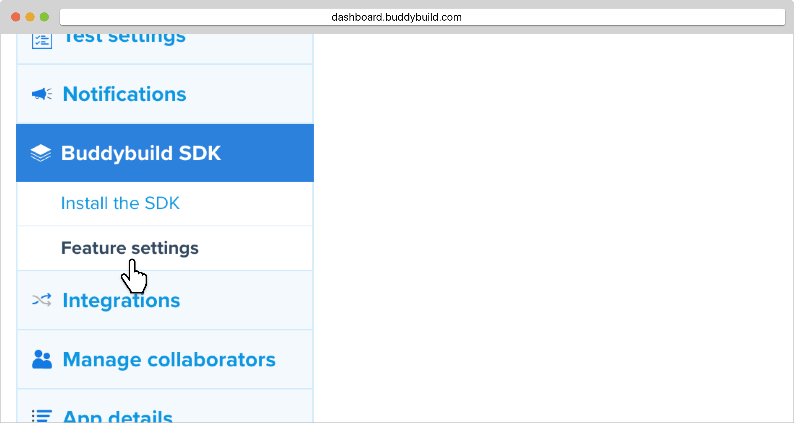
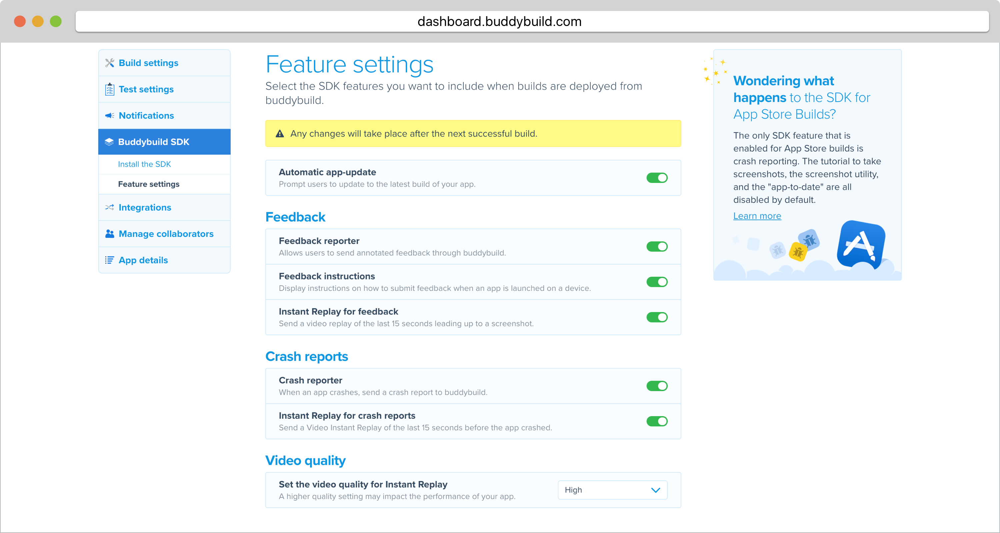

= SDK Feature Settings

Buddybuild lets you select which SDK features to include when builds are
deployed from buddybuild. In order to have these features available,
link:../quickstart/ios/integrate_sdk.adoc[integrate the buddybuild SDK]
on your desired branch.

[WARNING]
=========
**SDK Features for App Store builds**

Crash Reporting is the only SDK feature that is enabled for App Store
builds.

Builds that are deployed via buddybuild or TestFlight will still have
the tutorial to take screenshots, the screenshot utility, "app-to-date"
and Instant Replay!
=========

Here's how to configure the SDK feature settings!

Launch the buddybuild dashboard and select **App Settings**.

image:img/Builds---Settings.png[,1500,483]

In the left navigation, select **Buddybuild SDK**, then **Feature
settings**.

On the Feature Settings page, you can turn on or off the features that
you want to include on your builds.

[WARNING]
=========
**Note: Any changes made to Feature Settings will only take effect on
the next successful build.**
=========

That's it! You're done.
