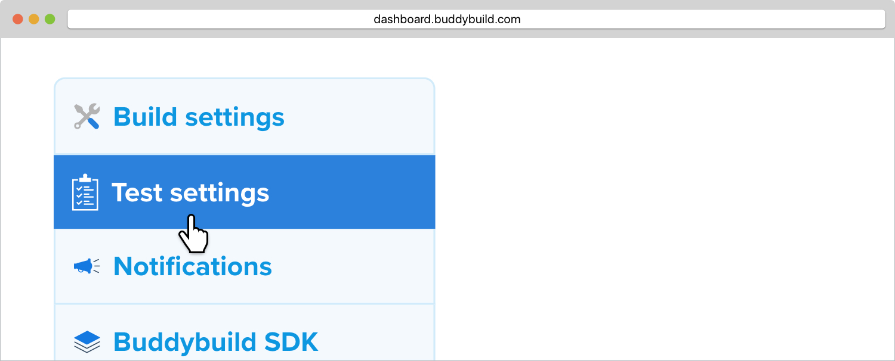
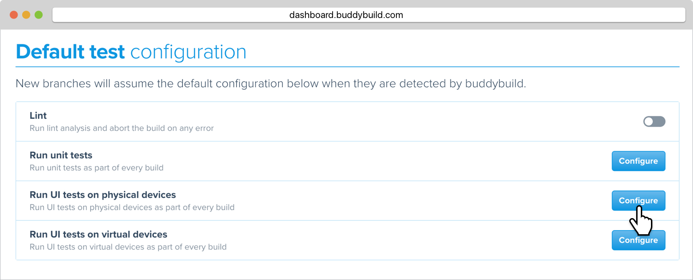
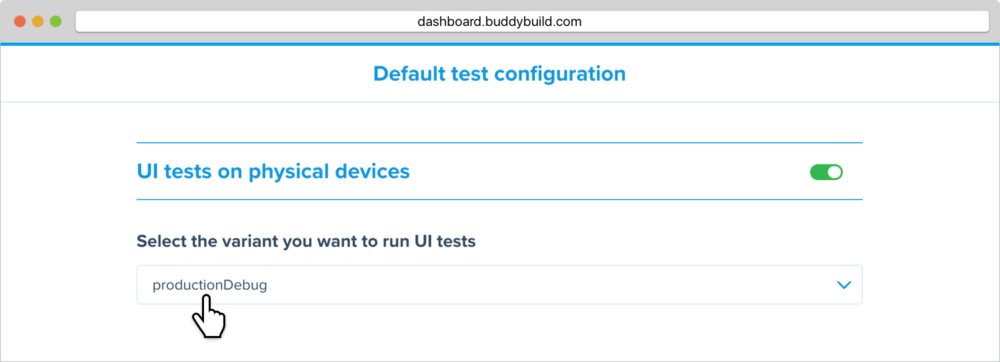
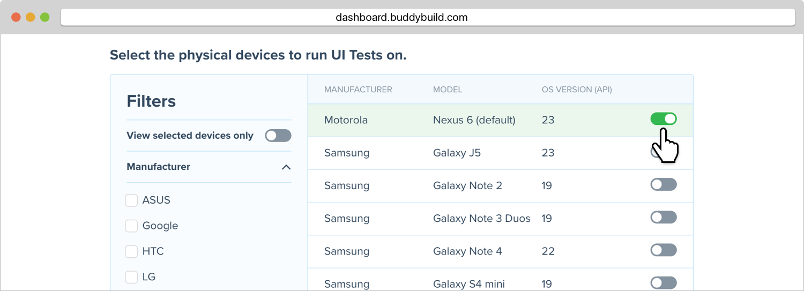
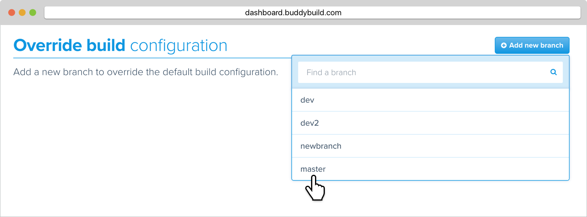
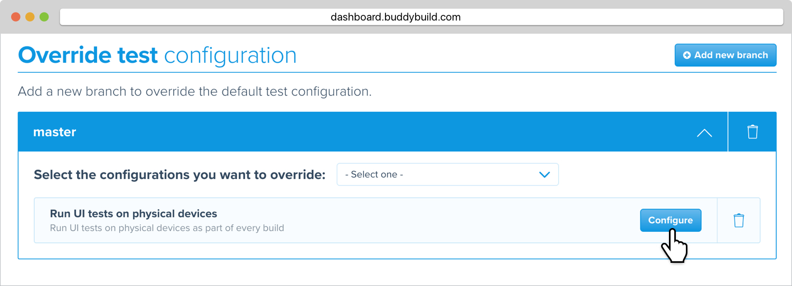

= UI Tests on Physical Devices

Ensure your Android app runs seamlessly on the exact devices your user
base owns. Buddybuild supports numerous mobile devices across different
OS versions and vendors. Select which physical devices to run your UI
tests against, and buddybuild will automate the rest!

[NOTE]
======
**Why run UI tests on physical devices?**

Running UI tests on physical devices could expose issues that may not
manifest when running on virtual devices. In addition, based off the
type of test, running on physical devices could lead to overall faster
test run times.

**Each physical device is charged per minute of use**. Depending on the
type of device and contention, there may be a delay before your tests
run.
======

== Setting up default UI tests on physical devices

You can set up default UI tests on physical devices that will apply to
all branches.

Start by clicking on **App Settings**.

image:img/Builds---Settings.png[,1500,483]

In the left navigation, click on **Test settings**.

Next, locate **Run UI tests on physical devices** and click **Configure**.

[WARNING]
=========
**Running UI tests on physical devices are charged per minute of use**

Annual plan subscribers will be invoiced once a month for running UI
tests on physical devices.
=========

Turn on **UI tests on physical devices**, then select the **variant**
you would like to run UI tests against.

Lastly, select the physical devices you want to run UI tests on.

=== Run UI tests on physical devices for a specific branch only

You can also run UI tests on physical devices for a specific branch by
creating a **branch-specific override**.

Under **Override build configuration**, click **Add a branch** and
select the branch you would like to run UI tests on physical devices
for.

Select **Run UI tests on physical devices** from the dropdown, then
click the **Configure** button.

You can now select the physical devices you want to run UI tests on for
your selected branch.
