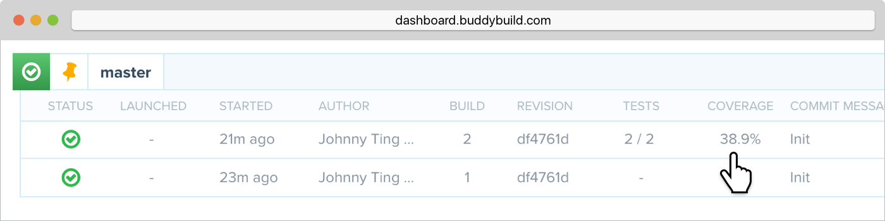

= Code Coverage for iOS apps

Code coverage measures the degree to which your code is tested by a
particular test suite.

While your tests are executing, they exercise code paths of your app.
Code coverage gives you a record of all code branches passed over by
your tests and provides insight into exactly how much of your code base
is being exercised during testing.

Here’s how to enable Code Coverage for your iOS app:

- In Xcode, from the **Product** menu, choose **Scheme** and **Edit
  Scheme**

- Select the **Test** tab in the left column

- Toggle on the **Gather coverage data** checkbox

image:img/6.png[]

Now that Code Coverage is enabled in Xcode, the next step is to enable
Tests in buddybuild.

- First, navigate to your app in buddybuild.

- Next, simply click on **Settings** (the "Gear" icon in the header bar)
  and switch on **Tests**.

image:img/Settings-Tests.png[]

You'll now be presented with code coverage reports in the buddybuild
dashboard (the **Coverage** column):

You can also dig into the build details by selecting the **Code
Coverage** tab to see the breakdown:

image:img/Builds_details-Code_coverage_page.png[]

== Want to exclude your CocoaPods dependencies from Code Coverage?

You can exclude your Pods from Code Coverage by adding the following
post install script in your **Podfile**.

[[code-samples]]
--
.Podfile
[source,bash]
----
post_install do |installer|

# Disable code coverage for all Pods and Pods Project
installer.pods_project.targets.each do |target|
    target.build_configurations.each do |config|
        config.build_settings['CLANG_ENABLE_CODE_COVERAGE'] = 'NO'
    end
end
installer.pods_project.build_configurations.each do |config|
    config.build_settings['CLANG_ENABLE_CODE_COVERAGE'] = 'NO'
end
end
----
--

