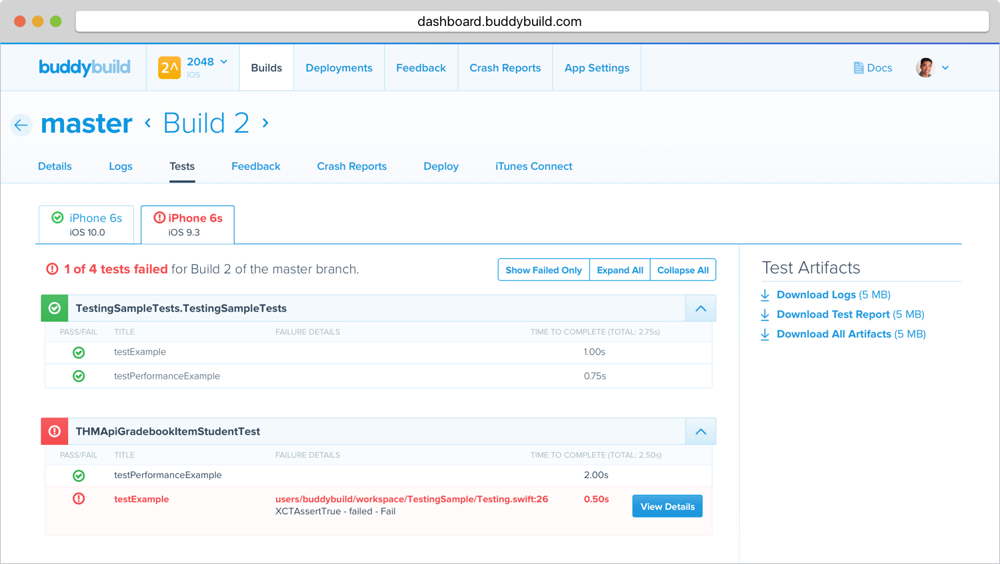

= Unit Tests

Buddybuild will automatically scan for your **XCTests** and run them for
you as part of every build! No configuration required!

If you like to see the test run details, simply navigate to the
**Tests** tab in the build details page. See pass/fail counts, suite and
test level results.

You also have access to the full test logs from the **Logs** tab under
Build Details.
