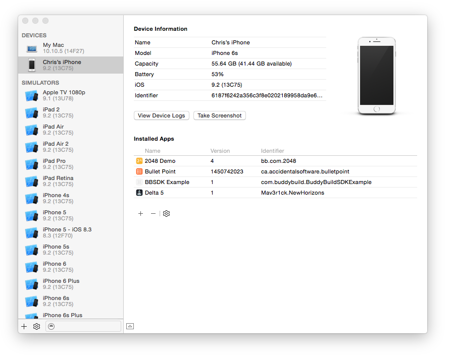
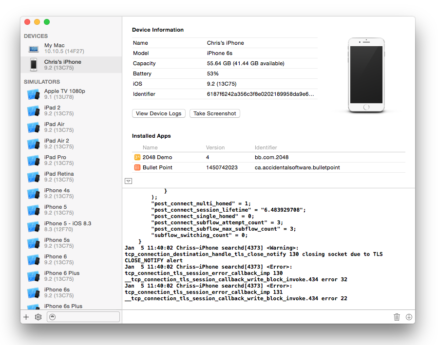

= Getting device logs from Xcode

When trying to diagnose why a build does not install or an issue with
your app or our SDK, it can be useful to retrieve device logs.

. Connect your phone to your laptop and open Xcode

. Select 'Devices' from the 'Window' menu
+
image:img/Screen-Shot-2016-01-05-at-11.37.45-AM.png[,329,251]

. Select your phone from the left panel
+

. Make sure the logs are expanded
+
If they are not, press the small up arrow in the bottom left corner
+

