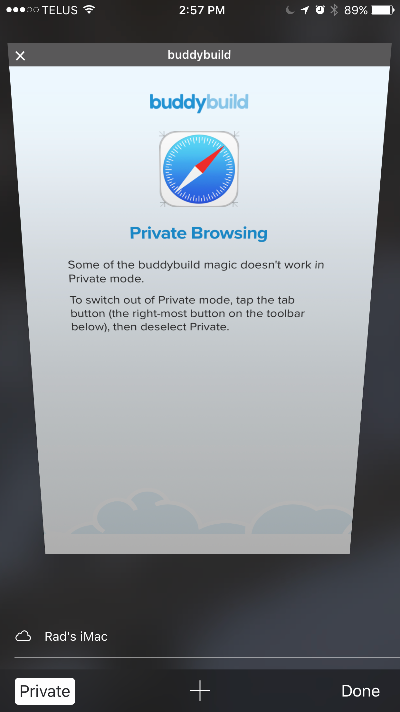

--- 
titletext: Troubleshooting iOS Mobile App build installations
description: >
  Troubleshoot common iOS build installation issues such as no build available
  to download, build will not install on device, unable to download app, and more
---
= Trouble installing builds on iOS

== No build available to download

If you have not yet uploaded a
link:../../deployments/ios/code_signing/README.adoc[code signing
certificate], buddybuild cannot properly sign your application. This
means that a successful build cannot be installed on a device, and so
buddybuild does not make the build artifact available for download.
This situation does not prevent your tests from running.

== Build will not install on a device

Almost every case of an app not installing on a device is caused by an
existing version of the app already installed conflicting with
buddybuild's attempt to install it.

In particular, buddybuild cannot install on top of an App Store version.
Please delete any App Store versions before attempting to install an app
through buddybuild.

== "Unable to Download App" message

This error is quite generic and could be caused by the following
reasons, but not limited to:

- UDID is not included in the provisioning profile

- The build was incorrectly signed or has broken entitlements

- Device or iOS version is incompatible with the build

- Device storage is full

- You've reached your device provisioning limit in your Apple Developer
  Account (See your  "Remaining devices" in your **App Settings >
  Integrations > Apple Developer Portal**)

Sometimes a "Rebuild without cache" might get you going, but if you are
still experiencing this, we recommend you
link:getting_device_logs_from_xcode.adoc[get the device logs] and reach
out to us on Intercom.

== Private Browsing

This issue is caused when opening the link in **Private** mode in
Safari. Here's how to turn off Private browsing:

. Tap the tabs button (the right-most button in the bottom toolbar below)
+
image:img/IMG_3643.png["Buddybuild's Private Browsing error page, as
displayed on an iPhone", 1242, 2151]

. Tap on **Private** to deselect it.
+

. Quit Safari, then click on the install link again.

If you still see this error message, make sure cookies are not disabled
on your device.

image:img/Allow-Cookies.png["Two iPhone screenshots showing how to
navigate to Safari's cookie settings", 1032, 903]

== Nothing happens when trying to register the device or to install the app

This issue is caused when opening the link in a
**SFSafariViewController** (a stripped down version of Safari in third
party apps) and not **Safari**, the main app itself.

The issue can be fixed by forcing the link to open in Safari. Then to
install from Safari:

image:img/SFSafariViewController.png["Buddybuild's Register Your Device
screen as displayed on an iPhone, with the 'Install Profile' popup
displayed", 1242, 2144]

=== Profile installation Failed: Couldn't communicate with a helper application

When you get this error while trying to install the buddybuild profile,
try the following:

- Open the Settings app

- Go to **General** > **Profiles** on the device

- Remove the buddybuild config profile

- Visit https://dashboard.buddybuild.com/reset

- Try to reinstall the build, buddybuild should ask to install the
  profile again.
